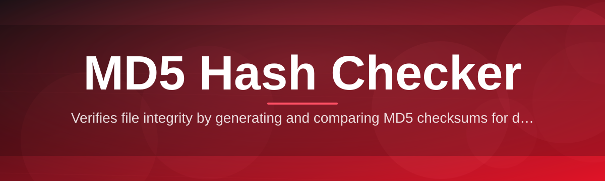

# hash-checker-utility

Verifies file integrity by generating and comparing MD5 checksums for devs who need quick validation.

  

## Overview

Verifies file integrity by generating and comparing MD5 checksums for devs who need quick validation.

## License

[MIT License](LICENSE)
